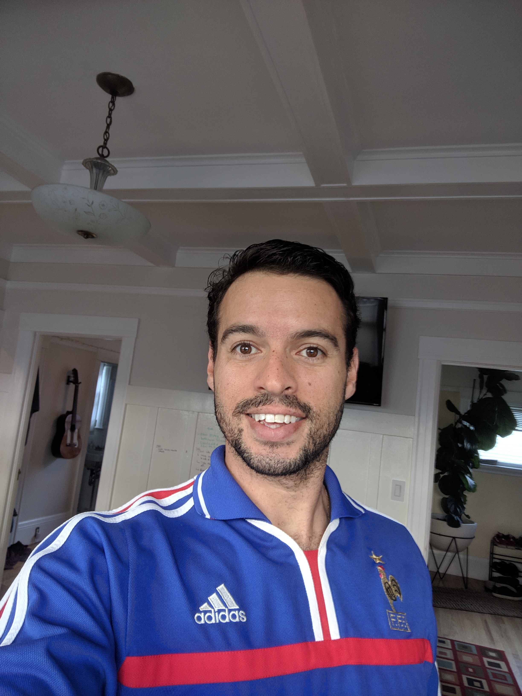

So this is my first post on my new blog, almost 5 months into my new job at Uber as a software engineer!

**Couple things I plan on writing about:**

- My life working as an engineer with Uber
- Things I like/dislike about living in the Bay Area as a new environment
- Tech I learned and/or want to learn
- Random stuff I would like to put online (most exciting!)

So stay tuned, in the meantime here's a couple inspiring quotes by [Daisaku Ikdea](https://www.daisakuikeda.org)

> With love and patience, nothing is impossible.

> A person, who no matter how desperate the situation, gives others hope, is a true leader.

> The determination to win is the better part of winning.

Til' next time! 👋

Here's a lil something to keep you while you wait...me 😉

